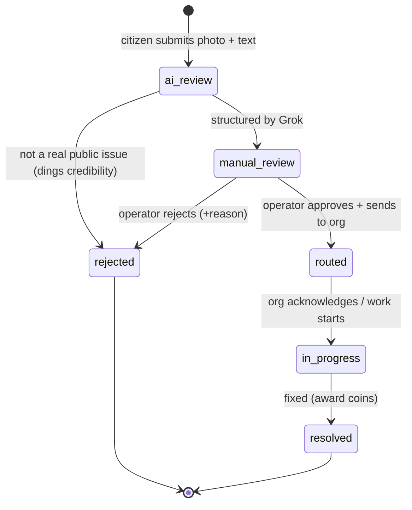

# Architecture

Openwave is **two surfaces over one data model**. Everything below exists to keep
those two surfaces in sync and to make every automated decision explainable in Q&A.

```
        CITIZEN APP (mobile)                       ADMIN DASHBOARD (web)
   photo + typed description + GPS            map (heatmap ⇄ threads), queue,
   live status stepper, X-style threads       approve/override, route, reject,
   coins / rewards                            notes, deadline, import, export PDF
              │                                            │
              └───────────────┬────────────────────────────┘
                              ▼
                     FastAPI  (main.py)
                              │
        ┌─────────────────────┼───────────────────────────────┐
        ▼                     ▼                                ▼
   ai_intake.py          taxonomy.py                      clustering.py
   (Grok vision:         (category×severity → SLA days,   (75 m + same category
   relevance, category,   category → real org)             + open → join thread;
   severity, AZ text,                                       priority + heat colour)
   dedup tags)
        └─────────────────────┴───────────────────────────────┘
                              ▼
                      models.py  (SQLModel)
              User · Report · Issue(=thread) · Organization
                              ▼
                         SQLite (demo)  /  Postgres (prod)
```

## The lifecycle (shared by both sides)



The same `IssueStatus` enum drives the **operator pipeline** (what the admin acts
on) and the **citizen stepper** (the progress bar the reporter watches). They
cannot drift because neither side may use a value not in `enums.py`.

## Intake data flow (the golden path)

1. Citizen submits **photo + typed description + GPS** → `POST /reports`.
2. `ai_intake.analyze_image(image, mime, user_text)` → one **Grok** call returns
   validated JSON: `is_relevant`, `category`, `severity`, `confidence`, AZ
   `title`/`description`, dedup `tags`.
3. **If not relevant** → report rejected, citizen told why, credibility decremented.
4. **If relevant**:
   - deadline = `taxonomy.compute_deadline(category, severity)` (table, not AI)
   - org = `taxonomy.suggest_org(category)` (smart default; operator can change)
   - `clustering.find_thread(lat, lng, category, open_threads)` → join existing
     thread or open a new one (root report = the "main" post, X-style)
   - persist `Report` (+ `user_text`) and `Issue`; status = `manual_review`
5. Operator reviews in the dashboard → approve/override → `routed` → … → `resolved`.

## Two design choices that decide the Q&A

- **The AI classifies; it never predicts a date.** Deadlines come from a readable
  SLA table. "How do you get the deadline?" → policy, not a guess.
- **The AI proposes; the operator decides.** Every issue passes through
  `manual_review`. The model is a fast first pass, never the final authority.

## Components

| File | Responsibility |
|---|---|
| `backend/enums.py` | Shared contract: `IssueStatus`, `Severity`, `Category` (+ AZ labels) |
| `backend/taxonomy.py` | Routing + deadline brain: SLA matrix, category→org, real org list |
| `backend/ai_intake.py` | Grok vision call → validated `IntakeResult` |
| `backend/clustering.py` | Thread join rule + priority score + heatmap colour |
| `backend/models.py` | SQLModel entities + `init_db()` seeding orgs |
| `backend/main.py` | **(next)** FastAPI wiring all routes onto the above |
| `data/organizations.csv` | Real responsible bodies (reference) |
| `data/sample_import.csv` | Historical issues for the import feature |
